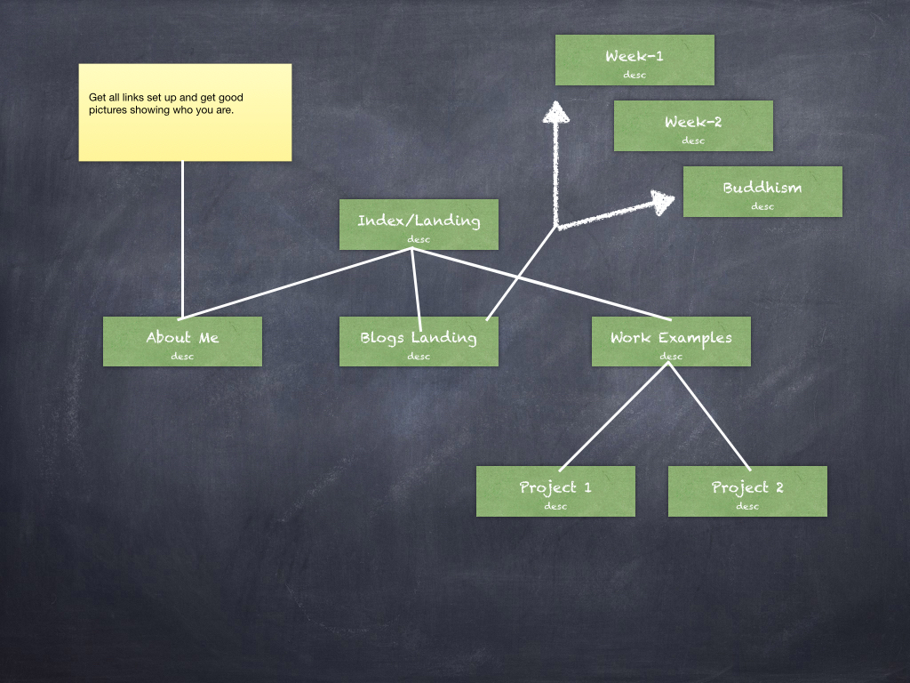

<!DOCTYPE html>
<html>
<head lang="en">
    <meta charset="UTF-8">
    <title></title>
</head>
<body>
<figure>
  
  <figcaption>Initial site map drawing</figcaption>
</figure>
<h2>What are the 6 Phases of Web Design?</h2>

<h2>What is your site's primary goal or purpose? What kind of content will your site feature?</h2>
<h2>What is your target audience's interests and how do you see your site addressing them?</h2>
<h2>What is the primary "action" the user should take when coming to your site?  
    Do you want them to search for information, contact you, or see your portfolio?  
    It's ok to have several actions at once, or different actions for different kinds of visitors.</h2>
<h2>What are the main things someone should know about design and user experience?</h2>
<h2>What is user experience design and why is it valuable?</h2>
<h2>Which parts of the challenge did you find tedious?</h2>
</body>
</html>
